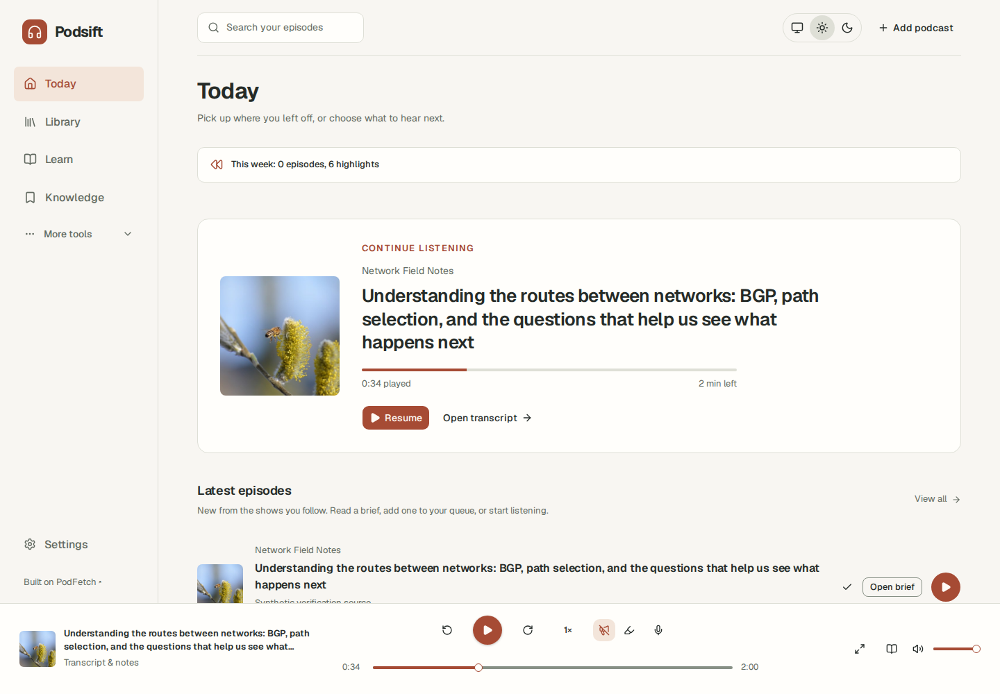

# Podsift

[](LICENSE)
[](https://github.com/rotemva3456/podsift/actions/workflows/ci.yml)

A podcast learning service for **your existing AI agent**, built on
**[PodFetch](https://github.com/SamTV12345/PodFetch)**. Give your agent a goal, podcasts
and the material you've already studied. It can read the transcripts, explain what's
worth hearing, and make a shorter listen from the original audio.

The aim is to make more podcasts worth listening to: less repetition, useful new
examples, and better recall. The web interface is optional.

You can also [import downloaded videos](docs/video-learning.md) in Learn, request
full timed speech transcription, and choose a cited recap or watch guide. Optional
Course Watcher review prepares the relevant visual moments for inspection.

## Start with your agent

1. Run the service and [connect its MCP server](docs/mcp.md) to your AI client.
2. Give the agent a show, episodes, or your library queue. It can also search the public
   podcast directory and follow a publisher's RSS feed.
3. Tell it what you want to learn, how much time you have, and what you already know.
   Books, notes and learning history can stay with the agent that already has them.
4. The agent reads the transcript pages, recommends **HEAR / READ / SKIP**, and chooses
   passages with source citations and reasons. It can export those passages as one MP3.

For example:

> I have 20 minutes. Find practical routing failure stories. I've studied route
> selection in my networking book; keep unfamiliar applications and corrections,
> skip the repeated basics, and quiz me afterwards.

The agent can submit its own selections without configuring another AI model inside
Podsift. The server checks transcript versions and line IDs, preserves explicit skips,
and applies the time budget. [Check the full keep/skip script before exporting](docs/mcp.md#agent-workflow).

## Learning context belongs to the listener

A familiar topic may still contain a new explanation, a counterexample, or a useful
prerequisite. The agent should compare those details with evidence from earlier
podcasts, books and notes, then explain its choices. Reading a title or finishing
playback does **not** prove that someone learned the material.

The connected agent owns this comparison and its learner memory. Podsift supplies the
words, timestamps, persistent cut plans and original audio; it does not automatically
import private books or maintain a semantic mastery model. After listening, the agent
can ask recall questions and keep the results in its existing memory. The built-in
"% new" score is a vocabulary comparison with finished episodes of the same show,
not a measure of understanding. [Product contract and current limits](docs/agent-first.md).

## What the service provides

- **Your existing AI.** The connected agent chooses passages using its own model and
  knowledge. Built-in AI features have an optional server provider; its key stays on
  the server and is never sent to the browser.
- **Hear useful passages.** Export the agent's selections as one MP3, or use Smart Play
  in the optional browser to skip the rest during playback — sponsors included.
- **Read the words.** Agents can page through the complete transcript, including text
  without timestamps, and inspect every sentence kept or skipped by a cut.
- **Keep a reason for each choice.** Agent plans can record that a passage repeats a
  book chapter or an earlier podcast, while keeping a new application of the same idea.
- **Optional listening interface.** Subscribe, search, queue, sync with AntennaPod over
  gpodder, or point any other app at your own private feeds — all from PodFetch itself.

## Optional web interface

Use the browser to listen, inspect transcripts and plans, or use the app's own AI
provider for briefs and cuts. These controls supplement the agent workflow.



*Sample content from the synthetic UI fixture; no personal library data is shown.*


- **Brief:** a summary, a HEAR / READ / SKIP verdict, and chapters. HEAR means the value
  is in reasoning or a story best heard; READ means it's mostly facts you could look up
  just as well from the text; SKIP means you already know it or it's not worth either.
- **Vocabulary overlap:** concepts that differ from finished episodes of the same show;
  broader prior learning is assessed by your connected agent.
- **Worth hearing:** an optional daily digest that briefs new episodes of shows you
  follow within a token budget you set, and a feed of only the ones marked HEAR.

## Choose how you listen

- **Focus or Chill:** choose listening effort when making a listen. Focus prioritizes difficult
  ideas, confusing parts and deeper reasoning for sharp sessions. Chill favors recap and clear
  explanations for relaxed listening. Your connected agent or the app's AI selects passages;
  you can also label your own selections. [How the modes work](docs/listening-effort.md).
- **Cut planner:** keyword matching (no AI) or describe what you want in your own words
  (AI). Either way you get a plan you can adjust before exporting one MP3, with an index
  back to the source timestamps.
- **Check the words before you cut:** the plan is a script of whole sentences. It shows every
  line it keeps with its timestamp, and every part it leaves out with the reason (sponsor, a
  word you skip, over your time, not what you asked for) and the brief's chapter.
- **Optional listen-back checks:** when the server has a speech provider for export
  checks, it hears the whole MP3 and compares it with the
  script: no clipped first or last words, no words from the parts you cut, no dead air where
  passages meet. A cut that's off is confirmed on the original audio and cut again from it,
  never patched. This spends speech-to-text minutes equal to the cut's length. Without
  that provider, an export reports `audio_only`; its words have not been checked by listening.
- **Smart Play:** skip a plan's passages live, without exporting anything.
- **Independent sponsor skipping:** Podsift detects explicit sponsor announcements,
  promotional offers and other skip categories in each episode's timed transcript.
  It works with ordinary podcasts as well as YouTube-origin episodes, keeps ambiguous
  passages, and needs no SponsorBlock API or community database. Saved cut scripts
  let you inspect the sponsor passages left out of an export. In the browser, choose
  automatic or manual skipping per category, ignore short passages, and undo a skip.
  Unchecked publisher timing always stays manual. [Controls and limits](docs/skipping.md).
- **Search inside every episode**, not just titles and descriptions.

## After you listen

- **Highlights and a weekly recap**, written from what you actually saved.
- **Flashcards** generated from an episode, reviewed on a spaced-repetition schedule,
  exported to Anki or Markdown.
- **Hands-free notes and questions** by voice, for listening while driving.
- **Ask this episode**, with citations back to the transcript.

## Your phone

Install the web app, sync through gpodder, or subscribe to your own private feeds with
AI chapters and sponsor segments already in them ([browser guide](docs/getting-started.md)).

## Install

For an install using the tested, published images, download and extract the
[v0.1.1 Docker bundle](https://github.com/rotemva3456/podsift/releases/download/v0.1.1/podsift-0.1.1-docker-r2.tar.gz).
It includes the public source and MCP package. The [release page](https://github.com/rotemva3456/podsift/releases/tag/v0.1.1)
has the checksum and validation details. Run the command below in the extracted folder.

Download this repository (GitHub **Code → Download ZIP**) and open a terminal in
the extracted folder, or clone it with Git, to build the images from source. Then run:

```bash
docker compose up -d --wait
```

Then [connect your agent](docs/mcp.md). The optional browser is at
**http://127.0.0.1:8080/ui/**. Needs Docker Engine 25+ and Compose 2.24+; runs
on amd64 and arm64 (a Raspberry Pi 4/5 or most NAS boxes work). Full install docs,
upgrade, backup and restore: **[`docker/README.md`](docker/README.md)**. Browser first
steps: **[`docs/getting-started.md`](docs/getting-started.md)**.

### Configure

Copy `.env.example` to `.env`, edit, then `docker compose up -d --wait` again. Every
setting is documented there; these are the ones most people change first:

| Variable | What it does |
|---|---|
| `APP_PORT` | Port on this computer (default `8080`). |
| `LLM_BASE_URL` / `LLM_API_KEY` / `LLM_MODEL` | Optional app provider for briefs, AI-mode cuts and Ask. |
| `TRANSCRIPTION_API_BASE_URL` / `_API_KEY` / `_MODEL` | Makes transcripts for episodes that don't already have one. |
| `BASIC_AUTH` / `USERNAME` / `PASSWORD` | Turn on a login. Do this before inviting anyone else. |
| `GPODDER_INTEGRATION_ENABLED` | Sync with AntennaPod and other gpodder apps (needs a login). |
| `COMPOSE_PROFILES=local-ai` | Run AI models locally with the bundled Ollama service. |

### AI providers

Your connected agent uses its own model and knowledge. An additional server-side
chat provider is optional for built-in briefs, AI-mode cuts and Ask; those support the
configured OpenAI-compatible providers or local Ollama. The repository's fixture
measurements are in **[`docs/models.md`](docs/models.md)**. Episodes without a publisher
transcript need a configured speech-to-text provider; requesting transcription may
incur charges.

## Privacy and security

This repository is the complete self-hosted app. Managed-service identity, billing,
quotas and deployment operations are maintained separately.

It's self-hosted: your episodes, transcripts, notes and optional app AI key are stored
on your own server, and the app AI key is never sent to your browser. Your connected
agent receives transcript text through MCP; its chosen provider's data handling applies.
Built-in AI features also send their source context to the provider you configure.
PodFetch's server-side features trust
signed-in users, so **only give accounts to people you already trust** — see
`SECURITY.md`.

## Known limits

- Platform account connections and external playlist imports are not implemented.
  Public RSS shows, subscribed episodes and the library queue work today.
- Agent-directed cuts require a timed transcript. Untimed text can be read completely
  for a recommendation, but cannot be turned into an exact audio cut.
- Sponsor skipping requires timed words and currently recognizes explicit English
  cues. Unmarked ads or tangents may remain; ambiguous passages are kept. Automatic
  skipping needs file-derived timing; publisher and library timing remains manual
  until it can be matched to the download. Accuracy on real episodes has not yet
  been benchmarked.
- **Worth hearing** only briefs new episodes automatically with login **off** — it has
  no session of its own to sign in with.
- Once login is **on**, private podcast-app feed links (above) need a normal invited
  account; the `BASIC_AUTH` bootstrap admin can't hold the API key a feed needs then.
- Load the demo (`docs/getting-started.md`) before you turn login on.
- The browser tab still uses PodFetch's upstream title. Docker installs serve a
  Podsift app manifest for home-screen installation.
- Publisher transcript timing may remain unchecked. Export reports whether it was
  verified against the downloaded file; Smart Play does not perform that verification.

## Legal

For the feeds you subscribe to. Don't republish other people's audio. This software
gives no rights to podcast content; you're responsible for how you use what you record
or export.

## Credits

Built on **[PodFetch](https://github.com/SamTV12345/PodFetch)** by SamTV12345 and
contributors, Apache-2.0 — the subscribing, downloading, playing, queueing, gpodder
sync and login this app is built on all come from there. If you find this useful,
[PodFetch also takes a coffee](https://ko-fi.com/samtv12345). What changed and what was
added on top of it: `CHANGES.md` and `NOTICE`.

## Contributing

Dev setup, checks and a few good-first-issues: **[`CONTRIBUTING.md`](CONTRIBUTING.md)**.
Security issues: **[`SECURITY.md`](SECURITY.md)**, not a public issue.
